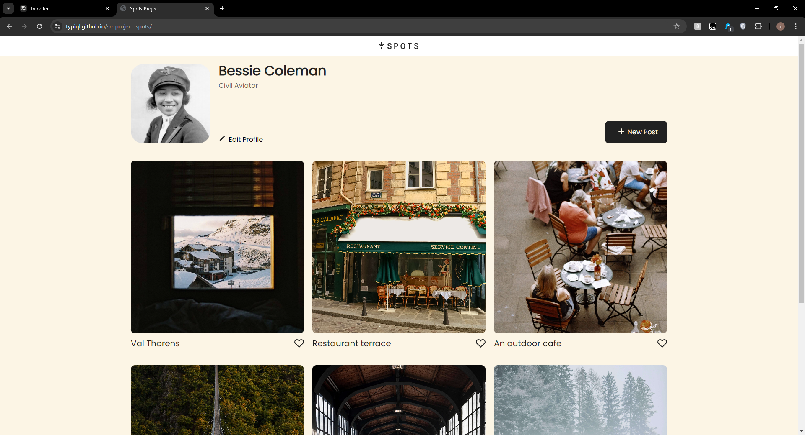
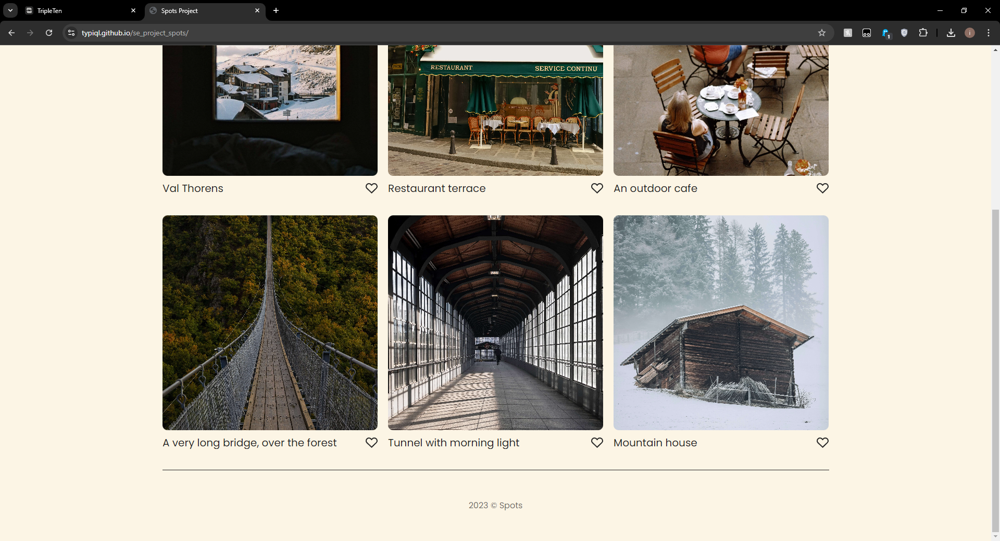

# Project Name
Spots Project

## Description
This is a simple blog style of page allowing any user to upload simple 1-line titled images for public viewing.

## Technologies and Techniques Used
- **HTML**: For structuring the webpage.
- **CSS**: For styling the webpage.

## Project Features
- Feature 1: The buttons on the page are active and now work compared to previous versions, using javascript.
- Feature 2: The page is interactive and will update at 640px width, making it available for mobile users as well.
- Feature 3: The profile title and descriptions will only continue to 3 lines and nothing past.

## Demo Video
Watch a video demonstration of the project: [Demo Video Link](https://youtu.be/Mcnvit57k8s)

## Screenshots

## Deployed Project
You can view the deployed project at: [GitHub Pages Link](https://typiql.github.io/se_project_spots/)
